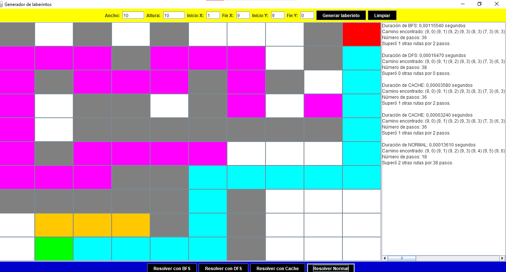

                                         

                                     

                               
        UNIVERSIDAD POLITÉCNICA SALESIANA

                                        
        INFORME DE PRACTICA: PROYECTO FINAL

            TRABAJO REALIZADO POR:
                 VIVIANA CARCHI

            CORREO INSTITUCIONAL:
            jcarchif@est.ups.edu.ec

                        
            TRABAJO DE 2DO CICLO

                        
             GRUPO No. 3, VESPERTINA

                    DOCENTE:
            ING. PABLO ANDRES TORRES PEÑA

                CARRERA DE COMPUTACIÓN
            ASIGNATURA DE ESTRUCTURA DE DATOS

            CICLO: MARZO 2024 – AGOSTO 2024
                                

*********************************************************************************************************
# 2. Introducción
Este informe presenta el desarrollo de una aplicación en Java para 
la procrear y resolver laberintos. La aplicación se compone  de diferentes algoritmos de búsqueda, como BFS y DFS, y una versión optimizada con cache para mejorar el rendimiento. Además, se ha implementado una interfaz gráfica de usuario (GUI) utilizando Swing para facilitar la interacción del usuario y permitir una configuración dinámica del laberinto.

 ******************************************************************************************************************
# 3. Descripción del Problema
El problema consiste en desarrollar una aplicación de creación y resolución de laberintos utilizando varios algoritmos. La aplicación debe permitir al usuario crear un laberinto con dimensiones personalizables y puntos de inicio y fin, así como resolver el laberinto utilizando diferentes métodos: búsqueda en amplitud (BFS), búsqueda en profundidad (DFS), y una solución optimizada con cache (programación dinámica). La aplicación debe mostrar los resultados y permitir la visualización de los caminos encontrados.

*******************************************************************************************************************
# 4. Objetivos:
a) Objetivo General:

Desarrollar una aplicación en Java que permita la generación, visualización y resolución de laberintos mediante algoritmos de búsqueda y técnicas de programación dinámica, con una interfaz gráfica amigable y configurable.

b) Objetivos Específicos:

Implementar los algoritmos de búsqueda BFS y DFS para la resolución de laberintos.
Desarrollar una versión optimizada del algoritmo con uso de cache para mejorar la eficiencia.
Crear una interfaz gráfica de usuario en Java que permita la personalización del laberinto y la visualización de resultados.
Facilitar la configuración dinámica del tamaño del laberinto, celdas transitables y puntos de inicio y fin.

*******************************************************************************************************************
# 5. Propuesta de Solución
a) Marco Teórico

Programación Dinámica: 
Es una técnica de mejoramiento que divide un problema en subproblemas más pequeños, resuelve cada subproblema una sola vez y almacena sus soluciones. Esto es útil en problemas donde las soluciones de subproblemas se reutilizan, reduciendo la complejidad computacional.

Búsqueda en Amplitud (BFS): Algoritmo de búsqueda que explora todos los nodos a un nivel antes de pasar al siguiente. Utiliza una cola para almacenar los nodos a explorar y garantiza encontrar el camino más corto en un laberinto con pesos uniformes.

Búsqueda en Profundidad (DFS): Algoritmo de búsqueda que explora tan profundo como sea posible en cada rama antes de retroceder. Utiliza una pila para almacenar los nodos a explorar y puede ser más eficiente que BFS en ciertos escenarios, pero no garantiza el camino más corto.

b) Descripción de la Propuesta de Solución
La propuesta de solución incluye el desarrollo de una aplicación en Java con una interfaz gráfica utilizando Swing. La aplicación permite al usuario:

•	Generar un laberinto con dimensiones personalizadas.
•	Configurar puntos de inicio y fin.
•	Resolver el laberinto utilizando los métodos BFS, DFS y una versión optimizada con cache.
Herramientas y Lenguajes Utilizados:

•	Java: Para el desarrollo de la aplicación.
•	Swing: Para la interfaz gráfica de usuario.
•	Estructuras de Datos: Se utilizan colas, pilas, mapas y listas para implementar los algoritmos de búsqueda y cacheo.
# 6.Estructura del Proyecto:

•	Modelo: 

Define la clase Celda que representa las celdas del laberinto y su estado (transitable/no transitable). 
La clase Laberinto maneja el estado general del laberinto.
•	Controlador:
 LaberintoControlador maneja la lógica de resolución del laberinto usando los algoritmos mencionados.
•	Vista: MazeGenerator proporciona una interfaz gráfica que permite al usuario interactuar con la aplicación.
•	Criterio Integrante de la Propuesta
•	Desarrollo de la lógica de generación y resolución del laberinto. Implementación de los algoritmos BFS y DFS.
•	Implementación de la interfaz gráfica y la integración con la lógica del laberinto. Implementación del algoritmo de programación dinámica (cache).
•	Pruebas y validación de la funcionalidad de la aplicación. Documentación y elaboración del informe.

*******************************************************************************************************************
6. Desarrollo
a) Interfaz Gráfica del Usuario (GUI)
Descripción de la interfaz gráfica, incluyendo:

Diseño: Cómo se estructuran los elementos visuales.
Componentes: Botones, áreas de texto, paneles, etc.
Colores y Estilo: Uso de colores (amarillo, azul, blanco) y estilo de la interfaz.
b) Funcionalidad del Código
Explicación detallada de las funcionalidades implementadas:

Generación de Laberintos: Cómo se crean y configuran los laberintos.
Resolución de Laberintos: Implementación de BFS, DFS y programación dinámica.
Visualización de Resultados: Cómo se muestran los caminos encontrados y otros resultados en la interfaz gráfica.

*******************************************************************************************************************
# 7. Análisis y Discusión
a) Logros
Evaluación de los principales logros del proyecto, como:

Implementación: funcionalidades completas y operativas.
Interfaz Intuitiva: Diseño de la GUI que facilita la interacción del usuario.
b) Desafíos
Descripción de los desafíos encontrados durante el desarrollo, por ejemplo:

Problemas Técnicos: Dificultades con los algoritmos o la interfaz gráfica.
Limitaciones del Proyecto: Aspectos que no se pudieron implementar o mejorar.
c) Mejoras Futuras
Sugerencias para futuras mejoras en la aplicación, como:

Optimización del Código: Mejoras en el rendimiento y eficiencia.
Nuevas Funcionalidades: Características adicionales que podrían añadirse.

*******************************************************************************************************************
 # 8. Conclusiones:
Conclusión: Mejor Opción para Encontrar el Camino Más Corto:
Breadth-First Search (BFS) es generalmente la mejor opción para encontrar el camino más corto en un laberinto no ponderado debido a su garantía de encontrar el camino más corto y su eficiencia relativa en términos de tiempo. Aunque puede consumir más memoria en comparación con DFS, la ventaja de encontrar el camino más corto lo hace superior para este propósito específico.

Extensiones del Proyecto
Visualización Paso a Paso: Implementar la visualización del proceso de búsqueda en tiempo real.
Algoritmos Adicionales: Incluir A* y Dijkstra para comparaciones de rendimiento.
Generación Aleatoria de Laberintos: Crear laberintos nuevos cada vez que se ejecuta el programa.
Interfaz Mejorada: Mejorar la UI con controles intuitivos y un diseño atractivo.
Optimización de Rendimiento: Implementar paralelización y optimización de memoria para laberintos grandes.
Aplicaciones Prácticas
Educación: Usar el proyecto como herramienta educativa para enseñar algoritmos y programación.
Robótica: Programar robots autónomos para navegar en entornos desconocidos.
Videojuegos: Crear niveles desafiantes y dinámicos mediante generación de laberintos.
Sistemas de Información Geográfica (SIG): Encontrar rutas óptimas en mapas y sistemas de navegación.
Optimización de Redes: Planificar rutas eficientes en redes de transporte y comunicación.

*******************************************************************************************************************
9. Anexos

https://github.com/Jenny-Vivi/Proyecto-Final-Estructuras